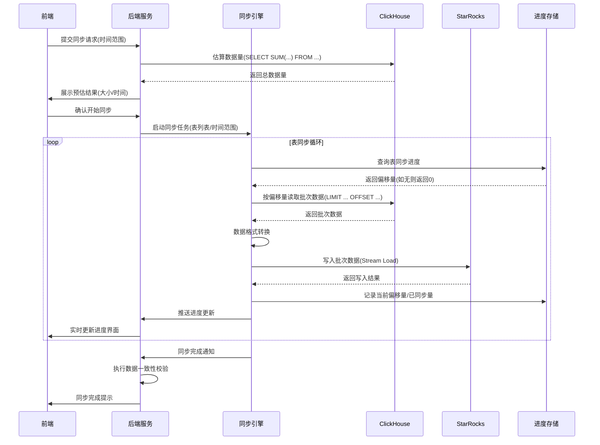
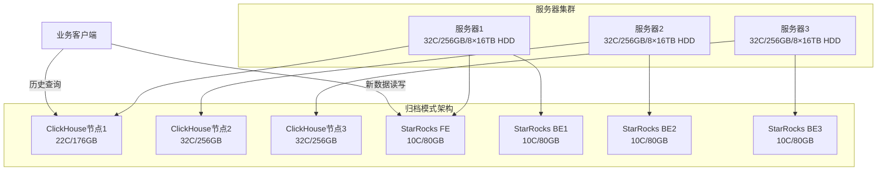

# ClickHouse 迁移至 StarRocks 3.3 版本技术方案设计文档

## 一、项目背景

某企业当前拥有 3 台 32C/256GB/8×16TB HDD（RAID5）服务器集群，运行着 ClickHouse 集群，该集群包含 50TB 数据、60 张表，TTL 为 180 天，采用无副本分片架构。当前系统 CPU 使用率 60%、内存 70%、磁盘 60%，处于万兆网络环境，服务层读写 QPS 比为 1:10。为提升系统性能与功能，企业计划将现有 ClickHouse 集群替换为 StarRocks 3.3 版本。

## 二、项目目标

设计一套满足用户两种迁移模式选择的方案，确保升级后所有数据入库和查询的数据源都切换到 StarRocks，并符合相关功能约束，同时提供清晰的界面原型、流程及时序图表、API 设计以及风险评估。

## 三、技术方案设计

### （一）迁移模式设计


1.  **归档历史数据模式**

*   技术原理：直接在现有服务器集群中安装部署 StarRocks 3.3 版本，保留原有的 ClickHouse 集群作为历史数据归档存储。由于不需要进行数据迁移，仅需进行新集群的部署和服务切换。

*   实施路径：

*   集群部署：在 3 台服务器上划分部分资源用于部署 StarRocks 集群，包括 FE（Frontend）节点和 BE（Backend）节点。FE 节点负责元数据管理和查询规划，BE 节点负责数据存储和计算。具体资源分配根据服务器现有负载情况确定，确保 StarRocks 集群能够正常运行。

*   服务切换：待 StarRocks 集群部署完成并验证无误后，将服务层的数据入库和查询请求切换到 StarRocks 集群。

1.  **同步历史数据模式**

*   技术原理：让用户选择需要同步的数据范围，后台启动同步进程，分批将 ClickHouse 中的数据写入 StarRocks。同步过程中通过控制数据传输速率，确保 IO 消耗不超过 100MB/s，以减少对查询性能的影响。

*   实施路径：

*   数据范围选择：用户在界面上选择需要同步的起始时间和结束时间，系统根据用户选择确定数据范围。

*   同步进程启动：用户点击开始同步后，后台启动同步进程，该进程从 ClickHouse 中读取指定范围内的数据，按照一定的批次大小进行处理后写入 StarRocks。

*   进度监控：同步进程实时计算同步进度和预期剩余时间，并将这些信息反馈到界面上，方便用户了解同步情况。

### （二）功能约束实现


1.  升级后数据源切换：通过修改服务层的配置，将所有数据入库和查询的数据源地址指向 StarRocks 集群，确保所有操作都在 StarRocks 上进行。

2.  归档历史数据模式下的线程调整：在保留的 ClickHouse 集群中，通过修改其配置文件，将后台 merge 线程数量调整为 2C，以减少其对服务器资源的占用。

3.  同步历史数据模式下的 IO 控制：同步进程在读取和写入数据时，通过控制每次读取和写入的数据量以及操作间隔，确保 IO 消耗不超过 100MB/s。同时，在界面上实时显示同步进度，如已同步数据量占总数据量的百分比，以及根据当前同步速率计算的预期剩余时间。

## 四、界面原型设计


1.  **迁移模式选择界面**

*   界面元素：包含两个主要按钮，分别为 “归档历史数据” 和 “同步历史数据”，以及相关的说明文字，向用户介绍两种模式的特点和区别。

*   界面布局：采用简洁明了的布局，两个按钮并排显示在界面中央，说明文字位于按钮上方。
```
┌─────────────────────────────────────────────┐

│              数据迁移模式选择                │

├─────────────────────────────────────────────┤

│  请选择迁移模式：                            │

│                                             │

│  ○ 归档历史数据                              │

│     - 保留ClickHouse作为历史归档             │

│     - 新数据直接写入StarRocks                │

│     - 切换时间：约30分钟                     │

│                                             │

│  ○ 同步历史数据                              │

│     - 同步指定时间范围的历史数据             │

│     - 同步完成后全量切换至StarRocks          │

│     - 同步时间：取决于数据量（预估XX小时）    │

│                                             │

│  \[ 下一步 ]                \[ 取消 ]          │

└─────────────────────────────────────────────┘
```

1.  **同步历史数据范围选择界面**

*   界面元素：包含起始时间选择器、结束时间选择器、“开始同步” 按钮，以及同步说明文字。

*   界面布局：时间选择器上下排列，“开始同步” 按钮位于时间选择器下方，说明文字位于最上方。
  ```
┌─────────────────────────────────────────────┐

│              历史数据同步设置                │

├─────────────────────────────────────────────┤

│  同步时间范围：                              │

│  开始时间：□□□□-□□-□□  □□:□□:□□             │

│  结束时间：□□□□-□□-□□  □□:□□:□□             │

│                                             │

│  预估数据量：15.6TB  预计同步时间：6.2小时   │

│                                             │

│  提示：同步过程中可能影响查询性能，建议在低峰期执行 │

│                                             │

│  \[ 开始同步 ]              \[ 返回 ]          │

└─────────────────────────────────────────────┘
```

1.  **同步进度显示界面**

*   界面元素：包含进度条、已同步数据量、总数据量、预期剩余时间显示区域，以及 “取消同步” 按钮（可选）。

*   界面布局：进度条位于界面上方，数据量和时间显示区域位于进度条下方，按钮位于最下方。进度条实时显示同步进度，数据量和时间信息动态更新。
  ```
┌─────────────────────────────────────────────┐

│              数据同步进度                    │

├─────────────────────────────────────────────┤

│  同步表：user\_behavior（3/60）               │

│  总进度：\[████████████░░░░░░] 60%           │

│                                             │

│  已同步：9.4TB / 总容量：15.6TB             │

│  当前速率：85MB/s  剩余时间：2.1小时         │

│                                             │

│  状态：同步中（IO使用率：65%）               │

│                                             │

│  \[ 暂停同步 ]              \[ 取消同步 ]      │

└─────────────────────────────────────────────┘
```

## 五、整体方案设计


1.  **整体流程图**


    ```mermaid
    graph TD
    A[用户登录系统] --> B{选择迁移模式}
    B -->|归档历史数据| C[安装部署StarRocks]
    C --> D[调整ClickHouse merge线程为2C]
    D --> E[切换服务层数据源至StarRocks]
    E --> F[完成迁移]
    B -->|同步历史数据| G[用户选择数据范围]
    G --> H[用户点击开始同步]
    H --> I[后台启动同步进程]
    I --> J[同步进程分批同步数据]
    J --> K[监控同步进度和IO消耗]
    K --> L{同步完成?}
    L -->|是| M[用户界面提示同步成功]
    M --> F
    L -->|否| J
    ```

2.  **同步历史数据时序图**




3.  **系统架构图**


    ```mermaid
    graph TD
    subgraph 服务器集群
    A[服务器1]
    B[服务器2]
    C[服务器3]
    end
    subgraph ClickHouse集群
    D[ClickHouse节点1]
    E[ClickHouse节点2]
    F[ClickHouse节点3]
    end
    subgraph StarRocks集群
    G[FE节点1]
    H[BE节点1]
    I[FE节点2]
    J[BE节点2]
    K[FE节点3]
    L[BE节点3]
    end
    A --> D
    A --> G
    A --> H
    B --> E
    B --> I
    B --> J
    C --> F
    C --> K
    C --> L
    D --> E
    E --> F
    G --> I
    I --> K
    H --> J
    J --> L
    G --> H
    I --> J
    K --> L
    ```

## 六、前后端交互的 API 设计


1.  **迁移模式选择 API**

*   接口名称：`/api/migration/selectMode`

*   请求方法：POST

*   请求参数：`mode`（字符串，取值为 "archive" 或 "sync"）

*   响应结果：`{"code": 200, "message": "模式选择成功"}`

1.  **同步数据范围提交 API**

*   接口名称：`/api/migration/submitSyncRange`

*   请求方法：POST

*   请求参数：`startTime`（时间戳）、`endTime`（时间戳）

*   响应结果：`{"code": 200, "message": "数据范围提交成功", "taskId": "任务ID"}`

1.  **同步进度查询 API**

*   接口名称：`/api/migration/querySyncProgress`

*   请求方法：GET

*   请求参数：`taskId`（字符串）

*   响应结果：`{"code": 200, "progress": 60, "remainingTime": "30分钟", "totalData": "100GB", "syncedData": "60GB"}`（progress 为百分比，remainingTime 为预期剩余时间）

1.  **服务切换 API**

*   接口名称：`/api/migration/switchService`

*   请求方法：POST

*   响应结果：`{"code": 200, "message": "服务切换成功"}`

## 七、数据同步模块设计

#### 1. 整体架构图




#### 2. 同步流程时序图


### （四）前后端交互 API 设计


| 接口名称                      | 请求方法 | 请求参数                                                   | 响应结果                                                                                                           | 说明               |
| ------------------------- | ---- | ------------------------------------------------------ | -------------------------------------------------------------------------------------------------------------- | ---------------- |
| `/api/migration/mode`     | POST | `{"mode": "archive\|sync"}`                            | `{"code": 200, "msg": "模式选择成功", "estimatedTime": "30分钟"}`                                                      | 选择迁移模式，返回预估耗时    |
| `/api/migration/range`    | POST | `{"startTime": "2023-01-01", "endTime": "2023-12-31"}` | `{"code": 200, "dataSize": "15.6TB", "estimatedSyncTime": "6.2小时"}`                                            | 提交同步时间范围，返回预估数据量 |
| `/api/migration/start`    | POST | `{"taskId": "sync_123"}`                               | `{"code": 200, "msg": "同步已启动", "taskId": "sync_123"}`                                                          | 启动同步任务           |
| `/api/migration/progress` | GET  | `{"taskId": "sync_123"}`                               | `{"code": 200, "progress": 60, "synced": "9.4TB", "total": "15.6TB", "speed": "85MB/s", "remaining": "2.1小时"}` | 查询同步进度           |
| `/api/migration/switch`   | POST | `{}`                                                   | `{"code": 200, "msg": "数据源已切换至StarRocks"}`                                                                     | 手动触发数据源切换        |

### （五）方案实施风险


| 风险类型    | 具体描述                                                 | 影响等级 | 应对措施                                                                                   |
| ------- | ---------------------------------------------------- | ---- | -------------------------------------------------------------------------------------- |
| 资源竞争风险  | 归档模式下，StarRocks 与 ClickHouse 共享服务器资源，可能导致 CPU / 内存争抢 | 中    | 1. 部署时通过 cgroups 限制两者资源上限（StarRocks CPU≤10C，内存≤80GB）2. 实时监控资源使用率，超过 80% 时触发告警并自动调整资源分配 |
| 同步中断风险  | 同步过程中服务器重启，导致进度丢失需从头同步                               | 高    | 1. 每批次同步完成后立即写入进度（包含偏移量、校验值）2. 进程启动时自动读取最近进度，支持断点续传                                    |
| 数据不一致风险 | 同步过程中 ClickHouse 数据发生变更（如更新 / 删除），导致与 StarRocks 不一致  | 中    | 1. 同步前对 ClickHouse 表执行`FREEZE PARTITION`创建快照2. 同步期间禁止对历史数据修改，新数据通过双写机制同步               |
| IO 超限风险 | 同步时 IO 突发超过 100MB/s，影响业务查询性能                         | 中    | 1. 基于`iostat`实现 IO 闭环控制，超限时自动降速2. 预设安全阈值（70% IO 使用率），提前触发限流                            |
| 切换失败风险  | 数据源切换后出现功能异常，需回滚至 ClickHouse                         | 高    | 1. 切换前备份服务层配置，支持一键回滚2. 切换后执行自动化校验用例，5 分钟内无异常则确认成功                                      |


```

