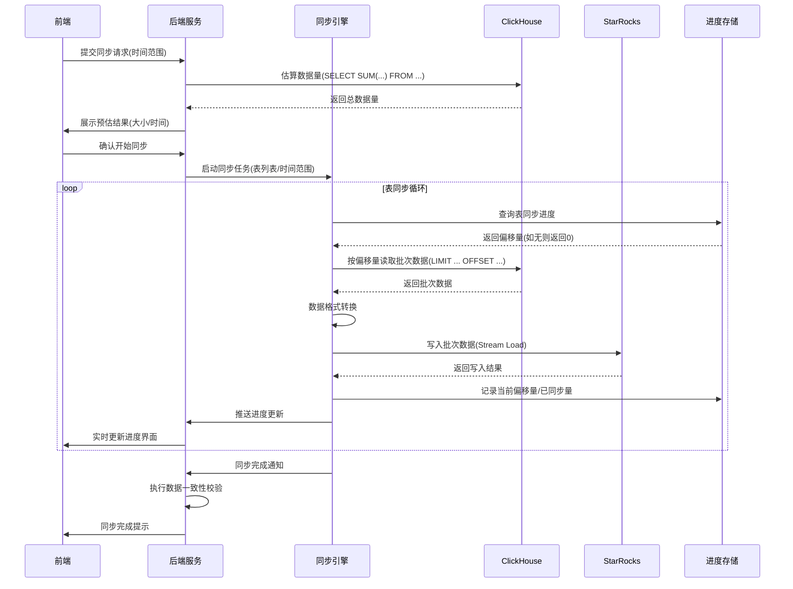
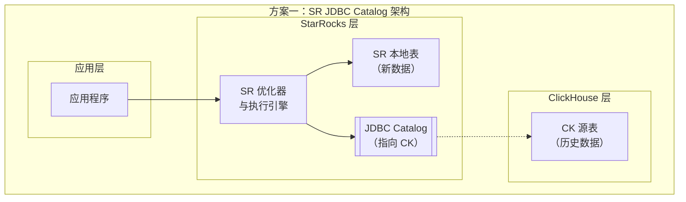
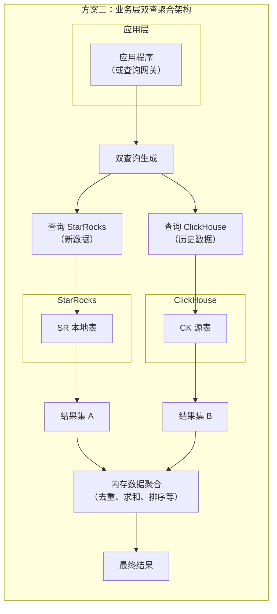
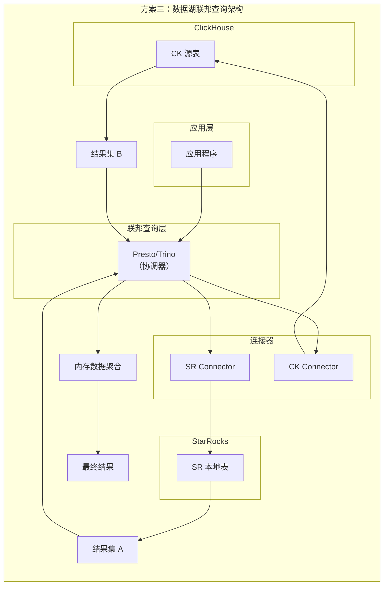

# ClickHouse 迁移至 StarRocks 3.3 版本技术方案设计文档

## 一、项目背景

某企业当前拥有 3 台 32C/256GB/8×16TB HDD（RAID5）服务器集群，运行着 ClickHouse 集群，该集群包含 50TB 数据、60 张表，TTL 为 180 天，采用无副本分片架构。当前系统 CPU 使用率 60%、内存 70%、磁盘 60%，处于万兆网络环境，服务层读写 QPS 比为 1:10。为提升系统性能与功能，企业计划将现有 ClickHouse 集群替换为 StarRocks 3.3 版本。

## 二、项目目标

设计一套满足用户两种迁移模式选择的方案，确保升级后所有数据入库和查询的数据源都切换到 StarRocks，并符合相关功能约束，同时提供清晰的界面原型、流程及时序图表、API 设计以及风险评估。

## 三、技术方案设计

### （一）迁移模式设计


1.  **归档历史数据模式**

*   **核心逻辑**：保留现有 ClickHouse 集群作为历史数据归档存储，全新部署 StarRocks 集群承接新业务读写，通过一次性切换实现数据源迁移。

*   **功能约束实现**：


    *   **数据源切换**：在 StarRocks 集群部署完成并验证通过后，通过修改服务层配置文件（如数据库连接池地址、API 路由指向），将所有数据入库接口（如 ETL 管道、业务系统写入接口）和查询接口（如 BI 工具、应用程序查询）的数据源地址统一指向 StarRocks 集群。切换完成后，通过灰度流量验证确保无请求路由至 ClickHouse。

    *   **ClickHouse 线程调整**：登录 ClickHouse 集群所有节点，修改`config.xml`配置文件中`background_pool_size`参数（默认为 16），设置为`2`（对应 2C 资源），并执行`SYSTEM RELOAD CONFIG`命令使配置生效。调整后通过`SELECT * FROM system.metrics WHERE metric LIKE '%BackgroundPool%'`监控线程池状态，确保 merge 线程数量稳定在 2C。

*   **实施步骤**：

1.  规划服务器资源分配（每台服务器划分 10C/80GB 内存给 StarRocks，剩余资源保留给 ClickHouse）

2.  部署 StarRocks 集群（1FE+3BE 架构，FE 部署在服务器 1，BE 分别部署在 3 台服务器）

3.  在 StarRocks 中创建与 ClickHouse 结构一致的表（通过`CREATE TABLE`语句复刻表结构，注意数据类型映射：如 ClickHouse 的`DateTime64`对应 StarRocks 的`DATETIMEV2`）

4.  调整 ClickHouse merge 线程参数并验证

5.  执行服务层数据源切换（选择业务低峰期，预计耗时 30 分钟）

6.  切换后验证（执行冒烟测试，检查读写功能正常）

1.  **同步历史数据模式**

*   **核心逻辑**：支持用户自定义时间范围同步历史数据，通过分批传输控制 IO 负载，同步完成后切换数据源，实现全量数据迁移。

*   **功能约束实现**：


    *   **数据源切换**：同步完成且数据一致性校验通过后，采用与归档模式相同的配置修改方式，将服务层数据源切换至 StarRocks。切换前需暂停新数据写入（或开启双写），确保最后一批历史数据与新数据无缝衔接。

    *   **IO 控制机制**：


        *   基于 Linux `iostat`工具实时监控磁盘 IO 使用率（每 5 秒采样一次），当发现`%util`指标超过 70%（对应 100MB/s IO 带宽）时，触发限流逻辑。

        *   同步进程通过动态调整批次大小实现限流：初始批次为 10 万行 / 批，当 IO 超限时自动缩减为 5 万行 / 批，间隔时间从 1 秒延长至 2 秒；当 IO 使用率低于 50% 时，恢复至初始批次。

    *   **进度展示**：


        *   前端通过进度条展示同步百分比（已同步字节数 / 总字节数），并基于最近 5 分钟平均速率计算剩余时间（剩余字节数 / 平均速率）。

        *   后端每 30 秒推送一次进度数据（包含已同步量、总容量、速率、剩余时间），前端实时更新界面。

*   **实施步骤**：

1.  用户在界面选择同步时间范围（如 2023-01-01 至 2023-12-31），系统自动估算数据量（通过 ClickHouse 的`SELECT SUM(data_compressed_bytes) FROM system.parts WHERE partition < ...`）

2.  启动同步进程（采用多线程架构，每表一个线程，最多并发 3 个表）

3.  按批次同步数据（读取→转换→写入→记录进度），实时监控 IO 并动态调整速率

4.  同步完成后执行全量校验（抽样 10% 数据对比、关键指标聚合校验）

5.  校验通过后切换数据源，关闭 ClickHouse 集群

6.  切换后验证（全量数据查询测试、性能压测）

### （二）功能约束实现


1.  升级后数据源切换：通过修改服务层的配置，将所有数据入库和查询的数据源地址指向 StarRocks 集群，确保所有操作都在 StarRocks 上进行。

2.  归档历史数据模式下的线程调整：在保留的 ClickHouse 集群中，通过修改其配置文件，将后台 merge 线程数量调整为 2C，以减少其对服务器资源的占用。

3.  同步历史数据模式下的 IO 控制：同步进程在读取和写入数据时，通过控制每次读取和写入的数据量以及操作间隔，确保 IO 消耗不超过 100MB/s。同时，在界面上实时显示同步进度，如已同步数据量占总数据量的百分比，以及根据当前同步速率计算的预期剩余时间。

## 四、界面原型设计


1.  **迁移模式选择界面**

*   界面元素：包含两个主要按钮，分别为 “归档历史数据” 和 “同步历史数据”，以及相关的说明文字，向用户介绍两种模式的特点和区别。

*   界面布局：采用简洁明了的布局，两个按钮并排显示在界面中央，说明文字位于按钮上方。
```
┌─────────────────────────────────────────────┐

│              数据迁移模式选择                │

├─────────────────────────────────────────────┤

│  请选择迁移模式：                            │

│                                             │

│  ○ 归档历史数据                              │

│     - 保留ClickHouse作为历史归档             │

│     - 新数据直接写入StarRocks                │

│     - 切换时间：约30分钟                     │

│                                             │

│  ○ 同步历史数据                              │

│     - 同步指定时间范围的历史数据             │

│     - 同步完成后全量切换至StarRocks          │

│     - 同步时间：取决于数据量（预估XX小时）    │

│                                             │

│  \[ 下一步 ]                \[ 取消 ]          │

└─────────────────────────────────────────────┘
```

1.  **同步历史数据范围选择界面**

*   界面元素：包含起始时间选择器、结束时间选择器、“开始同步” 按钮，以及同步说明文字。

*   界面布局：时间选择器上下排列，“开始同步” 按钮位于时间选择器下方，说明文字位于最上方。
  ```
┌─────────────────────────────────────────────┐

│              历史数据同步设置                │

├─────────────────────────────────────────────┤

│  同步时间范围：                              │

│  开始时间：□□□□-□□-□□  □□:□□:□□             │

│  结束时间：□□□□-□□-□□  □□:□□:□□             │

│                                             │

│  预估数据量：15.6TB  预计同步时间：6.2小时   │

│                                             │

│  提示：同步过程中可能影响查询性能，建议在低峰期执行 │

│                                             │

│  \[ 开始同步 ]              \[ 返回 ]          │

└─────────────────────────────────────────────┘
```

1.  **同步进度显示界面**

*   界面元素：包含进度条、已同步数据量、总数据量、预期剩余时间显示区域，以及 “取消同步” 按钮（可选）。

*   界面布局：进度条位于界面上方，数据量和时间显示区域位于进度条下方，按钮位于最下方。进度条实时显示同步进度，数据量和时间信息动态更新。
  ```
┌─────────────────────────────────────────────┐

│              数据同步进度                    │

├─────────────────────────────────────────────┤

│  同步表：user\_behavior（3/60）               │

│  总进度：\[████████████░░░░░░] 60%           │

│                                             │

│  已同步：9.4TB / 总容量：15.6TB             │

│  当前速率：85MB/s  剩余时间：2.1小时         │

│                                             │

│  状态：同步中（IO使用率：65%）               │

│                                             │

│  \[ 暂停同步 ]              \[ 取消同步 ]      │

└─────────────────────────────────────────────┘
```

## 五、整体方案设计


1.  **整体流程图**


    ```mermaid
    graph TD
    A[系统升级] --> A1[安装starrocks，升级其他服务]
    A1 --> B{选择迁移模式}
    B -->|归档历史数据| D[调整ClickHouse merge线程为2C]
    D --> F[完成迁移]
    B -->|同步历史数据模式| G[用户选择数据范围]
    G --> H[用户点击开始同步]
    H --> I[后台启动同步进程]
    I --> J[同步进程分批同步数据]
    J --> K[监控同步进度和IO消耗]
    K --> L{同步完成?}
    L -->|是| M[用户界面提示同步成功]
    M --> F
    L -->|否| J
    ```

2.  **同步历史数据时序图**





### （四）前后端交互 API 设计


| 接口名称                      | 请求方法 | 请求参数                                                   | 响应结果                                                                                                           | 说明               |
| ------------------------- | ---- | ------------------------------------------------------ | -------------------------------------------------------------------------------------------------------------- | ---------------- |
| `/api/migration/mode`     | POST | `{}`                            | `{"code": 200, "msg": "模式选择成功", "estimatedTime": "30分钟"}`                                                      | 选择迁移模式，返回预估耗时    |
| `/api/migration/range`    | POST | `{"mode": "archive\|sync"，"startTime": "2023-01-01", "endTime": "2023-12-31"}` | `{"code": 200, "dataSize": "15.6TB", "estimatedSyncTime": "6.2小时"}`                                            | 提交同步时间范围，返回预估数据量 |
| `/api/migration/start`    | POST | `{"taskId": "sync_123"}`                               | `{"code": 200, "msg": "同步已启动", "taskId": "sync_123"}`                                                          | 启动同步任务           |
| `/api/migration/progress` | GET  | `{"taskId": "sync_123"}`                               | `{"code": 200, "progress": 60, "synced": "9.4TB", "total": "15.6TB", "speed": "85MB/s", "remaining": "2.1小时"}` | 查询同步进度           |
| `/api/migration/switch`   | POST | `{}`                                                   | `{"code": 200, "msg": "数据源已切换至StarRocks"}`                                                                     | 手动触发数据源切换        |

### （五）方案实施风险


| 风险类型    | 具体描述                                                 | 影响等级 | 应对措施                                                                                   |
| ------- | ---------------------------------------------------- | ---- | -------------------------------------------------------------------------------------- |
| 资源竞争风险  | 归档模式下，StarRocks 与 ClickHouse 共享服务器资源，可能导致 CPU / 内存争抢 | 中    | 1. 部署时通过 cgroups 限制两者资源上限（StarRocks CPU≤10C，内存≤80GB）2. 实时监控资源使用率，超过 80% 时触发告警并自动调整资源分配 |
| 同步中断风险  | 同步过程中服务器重启，导致进度丢失需从头同步                               | 高    | 1. 每批次同步完成后立即写入进度（包含偏移量、校验值）2. 进程启动时自动读取最近进度，支持断点续传                                    |
| 数据不一致风险 | 同步过程中 ClickHouse 数据发生变更（如更新 / 删除），导致与 StarRocks 不一致  | 中    | 1. 同步前对 ClickHouse 表执行`FREEZE PARTITION`创建快照2. 同步期间禁止对历史数据修改，新数据通过双写机制同步               |
| IO 超限风险 | 同步时 IO 突发超过 100MB/s，影响业务查询性能                         | 中    | 1. 基于`iostat`实现 IO 闭环控制，超限时自动降速2. 预设安全阈值（70% IO 使用率），提前触发限流                            |
| 切换失败风险  | 数据源切换后出现功能异常，需回滚至 ClickHouse                         | 高    | 1. 切换前备份服务层配置，支持一键回滚2. 切换后执行自动化校验用例，5 分钟内无异常则确认成功                                      |
| 效果风险  | 切换过程中未开始同步的CK数据无法被查询可能影响安全效果                         | 高    | 1、通过SR共享catalog的机制将CK数据映射到SR中，确保从SR可以直接查询CK数据，降低业务影响（SR catalog：https://docs.starrocks.io/docs/3.5/data_source/catalog/jdbc_catalog/ ），约束：使用catalog方案目前只支持基础类型，并且查询性能会大幅下降。 2、XDR业务层支持同时查CK和SR，当时间跨度横跨在内存中完成最终指标聚合 3、数据湖单独提供一套引擎层，类似于presto支持业务场景的数据联邦查询
                                      |


###效果风险解决方案说明：


---

### 方案一：StarRocks JDBC Catalog 联邦查询方案

#### 实现思路与架构图

该方案利用 StarRocks 的 JDBC Catalog 功能，将 ClickHouse 映射为一个外部数据源。当查询命中的数据在 SR 本地表中不存在时，SR 会通过 JDBC 驱动自动去 CK 中查询，并在 SR 内部完成数据的拼接和计算。



**工作流程：**
1.  创建 Catalog：在 StarRocks 中执行 `CREATE EXTERNAL CATALOG ... PROPERTIES type='jdbc'...`，配置好 CK 的 JDBC 连接信息。
2.  应用查询：应用程序的查询语句直接发给 StarRocks。
3.  智能路由：StarRocks 优化器根据查询的 `WHERE` 条件（尤其是时间条件）判断数据所在位置。
    *   如果数据在 SR 本地表，则直接读取。
    *   如果需要的数据在 CK，则通过 JDBC Catalog 向 CK 发起查询。
    *   **如果时间跨度横跨两地**，SR 会**并行地**从本地表和 CK 拉取数据，然后在 SR 内部进行聚合、计算，最终返回一个完整的结果给客户端。
4.  对应用透明：整个过程对应用程序是完全透明的，应用无感知。

---

### 方案二：业务层双写双查聚合方案

#### 实现思路与架构图

该方案在业务层（或一个单独的数据查询网关）进行改造，使其具备同时查询 SR 和 CK 的能力，并在内存中完成数据的整合与计算。



**工作流程：**
1.  查询拆分：应用程序（或网关）接收到查询请求后，根据配置好的时间边界，将一条查询拆分成两条 SQL：
    *   一条发给 StarRocks，查询 `time >= '同步开始时间'` 的数据。
    *   一条发给 ClickHouse，查询 `time < '同步开始时间'` 的数据。
2.  并行查询：同时向 SR 和 CK 发起查询请求。
3.  内存聚合：等待两个数据源的结果返回后，在业务层内存中执行最终的数据聚合逻辑（例如：对两个结果集进行 `UNION ALL`，然后重新 `SUM`、`GROUP BY`，或者进行排序分页等）。
4.  返回结果：将聚合后的完整结果返回给前端。

---

### 方案三：数据湖联邦查询引擎方案

#### 实现思路与架构图

该方案引入一个第三方查询引擎（如 Presto/Trino），其能够同时对接 SR 和 CK，作为一个统一查询入口，对应用层提供数据联邦查询能力。



**工作流程：**
1.  统一入口：应用程序将查询请求发送给 Presto/Trino。
2.  语法解析：Presto 解析 SQL，根据配置的 Catalog 规则，确定哪些表来自 SR，哪些来自 CK。
3.  下推查询：Presto 将计算尽可能下推到 SR 和 CK 这两个数据源中去执行（谓词下推、聚合下推等）。
4.  联邦聚合：Presto 从两个数据源拉取部分结果集，在其工作内存中进行最终的混合计算。
5.  返回结果：将结果返回给应用程序。

---

### 深度可行性对比

| 维度 | 方案一：SR JDBC Catalog | 方案二：业务层双查聚合 | 方案三：数据湖联邦查询 |
| :--- | :--- | :--- | :--- |
| **核心原理** | 利用 SR 自身能力实现联邦查询 | 业务层代码硬编码或网关路由 | 引入独立通用联邦查询引擎 |
| **查询性能** | **较差**。JDBC 连接是单点，网络开销大，复杂查询性能下降严重，且压力集中在 CK 上。 | **可控**。取决于业务层聚合逻辑的复杂度。双并行查询，延迟取决于最慢的数据源。 | **中等**。优于 JDBC Catalog，但次于直接查询。Presto 有优化能力，但多一层网络跳转。 |
| **业务侵入性** | **极低**。应用无感知，无需修改代码，只需切换数据源为 SR。 | **极高**。需要重写所有相关查询的代码逻辑，开发、测试工作量巨大。 | **低**。应用只需将查询端点从 CK/SR 改为 Presto，SQL 语法可能需要微调。 |
| **功能完整性** | **受限**。受限于 JDBC Catalog 支持的数据类型和函数，复杂查询可能报错。 | **完全可控**。业务层想怎么聚合都行，灵活性最高。 | **强大**。Presto/Trino 对复杂 SQL 支持非常好，功能完整。 |
| **维护成本** | **低**。只需在 SR 中维护 Catalog 配置，运维简单。 | **极高**。逻辑耦合在业务代码中，后续难以维护。任何表结构变更都可能需要修改代码。 | **中高**。需要额外维护一套 Presto/Trino 集群，包括其高可用、性能调优等。 |
| **长期价值** | **低**。是**临时过渡方案**。数据同步完成后即可删除 Catalog，直接查询本地表。 | **无**。迁移完成后，所有相关代码需要被回滚或废弃，是**纯粹的技术负债**。 | **高**。**可以作为长期数据平台战略**。未来接入 Hive、Iceberg、MySQL 等数据源都非常方便。 |
| **可行性结论** | **推荐作为短期过渡方案**。优点在于**快速落地**，能第一时间解决问题，且对业务影响最小。**必须接受其性能损耗**，并明确其临时性。 | **最不推荐**。**除非其他方案都走不通**。该方案将迁移的复杂性完全转嫁给了业务开发，成本高昂且易出错，后期维护是噩梦。 | **如果团队有长期数据湖/数据中台规划，这是最佳选择**。虽然短期部署和运维成本较高，但一举多得，不仅解决了当前问题，还为未来打下了更好的基础。 |

### 专家总结与建议

1.  **首选方案（短期快速见效）**：**方案一（SR JDBC Catalog）**。这是最符合你们当前架构（产品升级后所有服务直接访问 StarRocks）的**最小化侵入式方案**。它能以最快速度上线，保证业务在迁移期间不受影响。**注意事项**：必须严格限制通过 Catalog 查询的 SQL 复杂度，最好只用于简单的 `SELECT ... WHERE ...` 查询，避免复杂 Join 和聚合。并提前和业务方沟通性能下降的预期。

2.  **战略方案（长期平台建设）**：**方案三（数据湖联邦查询）**。如果团队有精力和规划，这是一个将挑战转化为机遇的方案。部署一套 Presto/Trino 可以作为统一查询网关，不仅解决当前 CK->SR 的迁移问题，未来还可以轻松集成其他数据源，构建企业级数据湖仓一体化平台。

3.  **尽量避免的方案**：**方案二（业务层聚合）**。这个方案的开发和维护成本是黑洞，除非你们的查询非常简单且数量极少，否则强烈不推荐。它会使核心业务代码变得极其臃肿和脆弱。

**最终行动建议**：
**采用“方案一为主，方案三为远期规划”的组合策略**。
- **立即实施方案一**，确保产品升级和迁移过程平稳。
- **在迁移后期，数据同步完成后，逐步减少并最终禁用 JDBC Catalog**，让所有查询都走向 SR 本地表，获得最佳性能。
- **同时，可以开始调研和测试方案三**，为未来的数据平台演进做好技术储备。

