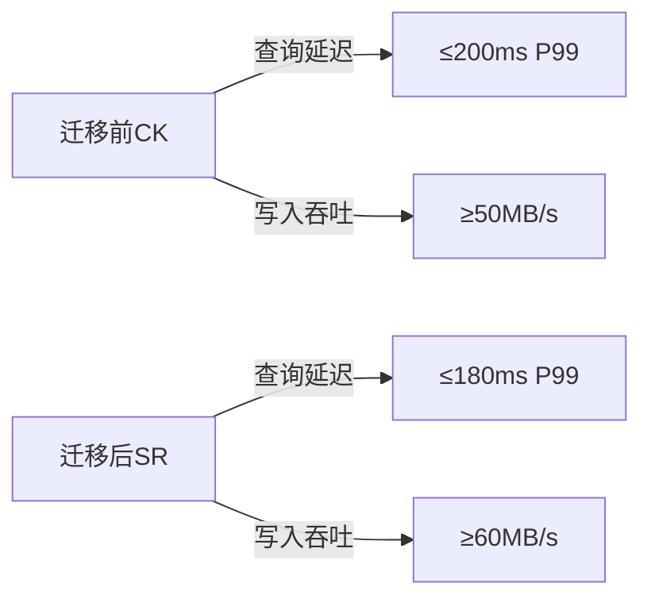
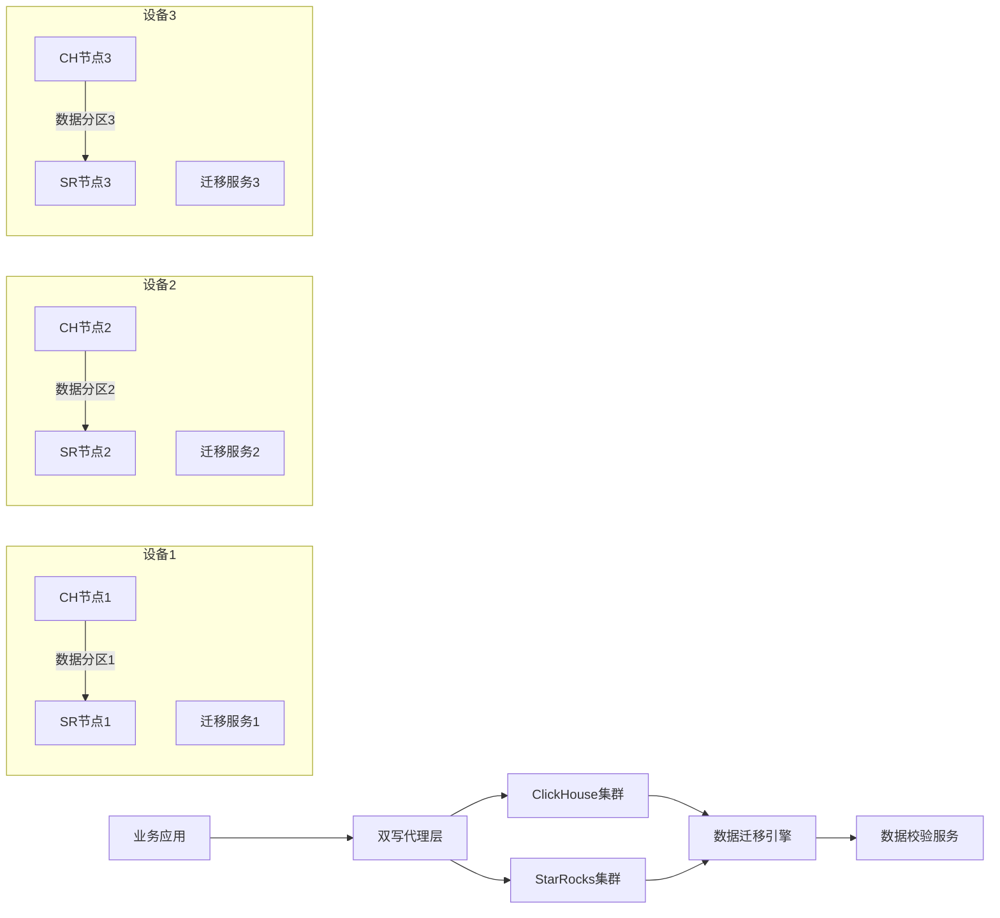
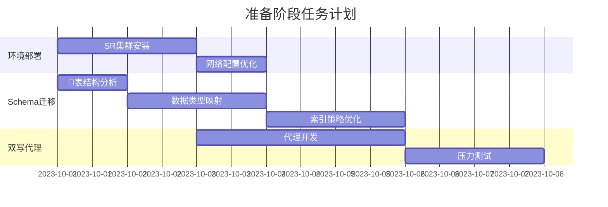
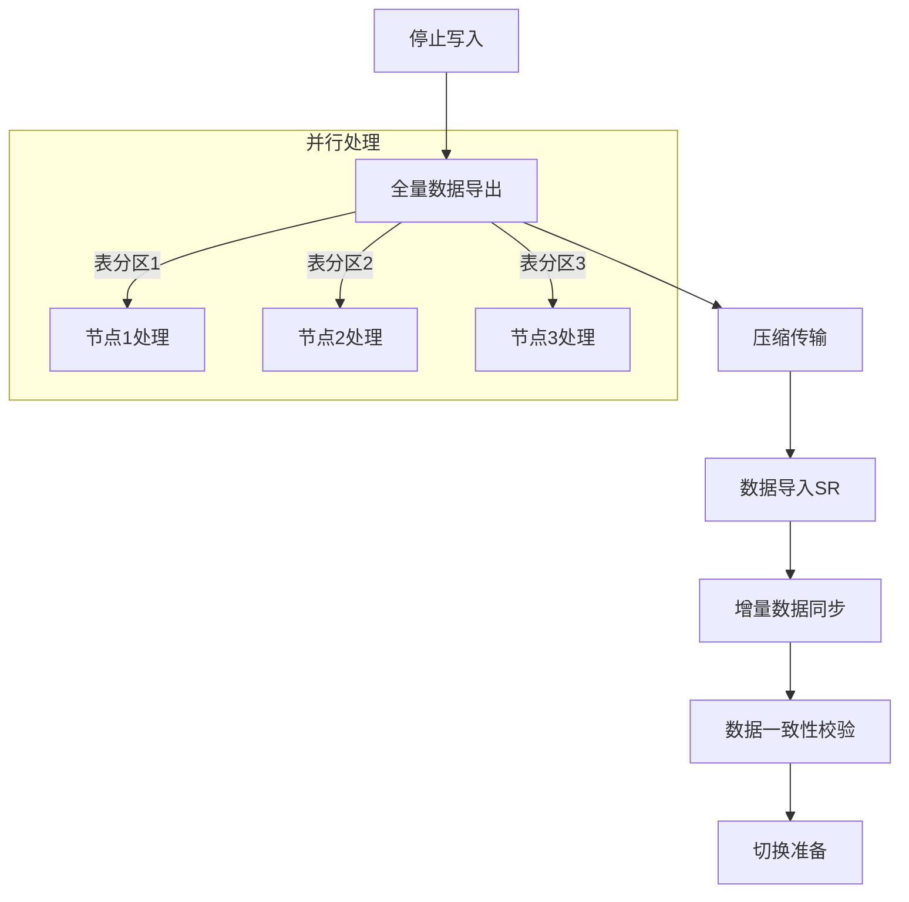
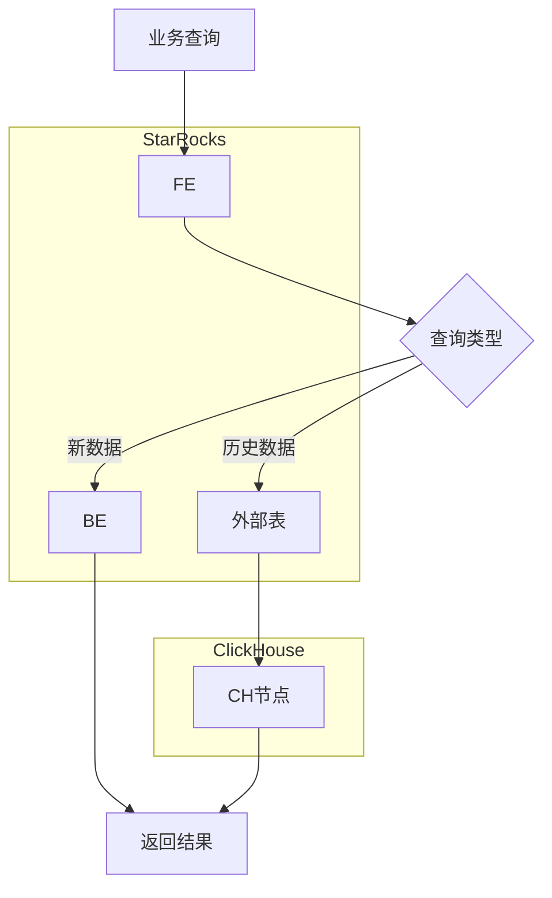
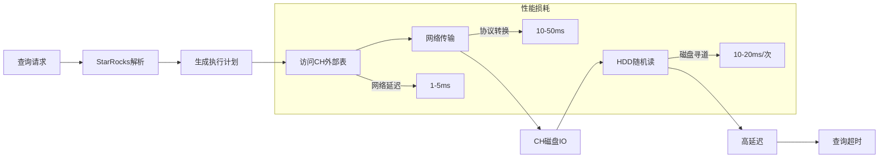
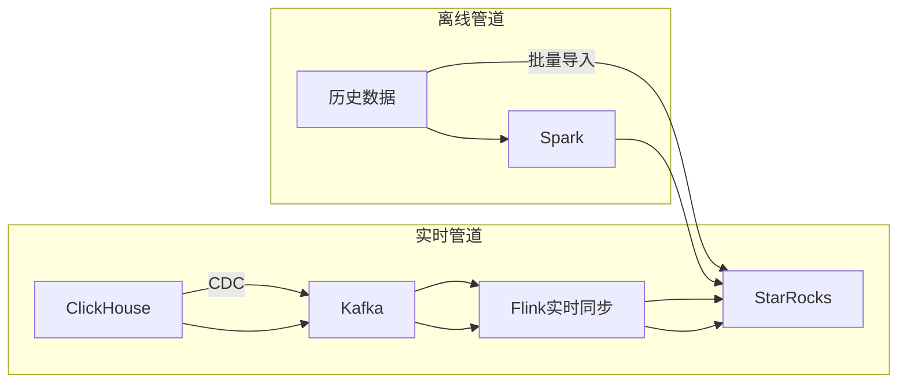
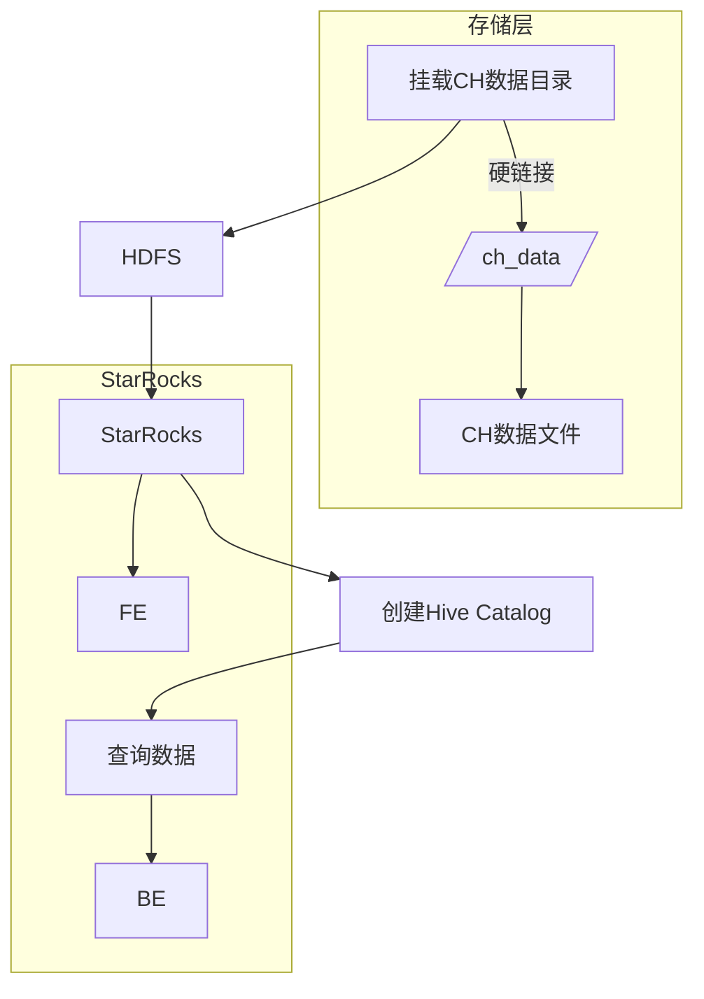
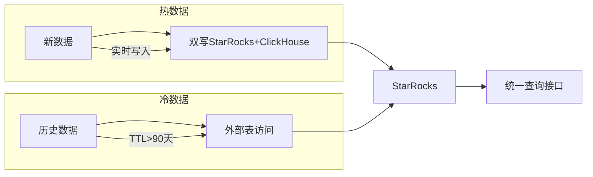
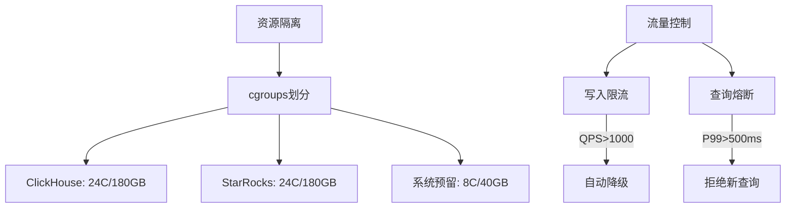

# ClickHouse迁移StarRocks方案设计文档（修订版）
# ClickHouse迁移StarRocks方案设计文档

## 1. 背景介绍
随着公司业务战略转型，现有基于ClickHouse的数据分析平台已无法满足新的业务需求。当前系统部署在三台物理设备上，运行着ClickHouse集群及关联业务服务，存储约50TB业务数据（分布在60张表中），数据保留周期为180天。为提升实时分析能力、降低运维复杂度并适应未来扩展需求，需将ClickHouse全面替换为StarRocks。本次迁移需确保：
- 数据零丢失
- 业务中断时间≤8小时
- 仅使用现有三台设备资源

## 2. 目标
| 目标维度       | 具体指标                          |
|----------------|----------------------------------|
| 数据完整性     | 迁移后数据100%一致，无任何丢失    |
| 业务连续性     | 查询服务中断时间≤5分钟            |
| 资源利用率     | 迁移期间CPU峰值≤85%，内存≤80%     |
| 迁移时效       | 全流程7天内完成（含观察期）       |
| 系统稳定性     | 迁移后查询性能波动≤10%            |
| 成本控制       | 零新增硬件资源消耗                |

## 3. 缩写及专业名词定义
| 术语         | 定义说明                                                                 |
|--------------|--------------------------------------------------------------------------|
| **CK**       | ClickHouse，开源列式数据库，擅长OLAP场景                                 |
| **SR**       | StarRocks，新一代高性能全场景MPP数据库                                   |
| **TTL**      | Time-To-Live，数据生存周期策略（本场景统一为180天）                      |
| **双写**     | 数据同时写入新旧两个系统的保障机制                                       |
| **Stream Load** | StarRocks高吞吐数据导入接口，支持CSV/JSON格式                          |
| **MPP**      | Massively Parallel Processing，大规模并行处理架构                       |
| **RAID 5**   | 磁盘冗余阵列技术，提供数据安全保障（本场景8×16TB HDD组RAID 5）          |
| **QPS**      | Queries Per Second，每秒查询量（当前读写比1:10）                        |

## 4. 性能规格及约束
### 4.1 硬件资源约束
| 资源类型   | 单机规格         | 集群总量   | 当前使用率 | 迁移可用余量 |
|------------|------------------|------------|------------|--------------|
| CPU        | 32核             | 96核       | 60%        | ≤85%峰值     |
| 内存       | 256GB            | 768GB      | 70%        | ≤80%峰值     |
| 存储       | 8×16TB RAID 5    | ≈300TB     | 60%        | 120TB可用    |
| 网络       | 万兆网卡         | 10Gbps     | -          | 全带宽可用   |

### 4.2 可靠性要求
| 指标               | 要求                      | 保障措施                                  |
|--------------------|---------------------------|------------------------------------------|
| 数据一致性         | 零丢失，100%一致          | 停写+全量校验+双写兜底                   |
| 服务可用性         | 全年99.9%                 | 滚动切换+快速回滚机制                    |
| 故障恢复时间       | ≤15分钟                   | 快照备份+容器化部署                      |
| 资源过载保护       | CPU/Mem阈值自动熔断       | cgroups资源隔离+动态限流                 |

### 4.3 性能约束



## 5. 方案选型（详细扩展）

### 5.1 方案一：全量迁移+双写过渡（推荐方案）

#### 5.1.1 架构设计详解



**架构说明**：
1. **双写代理层**：无状态服务部署在三台设备上，实现写请求的分发
2. **数据迁移引擎**：基于Python的多进程迁移工具，支持断点续传
3. **数据校验服务**：独立部署的Spark应用，执行分布式数据校验

#### 5.1.2 详细实施过程

##### 阶段1：准备工作（D-7至D-1）


1. **StarRocks集群部署**：
   - 每台设备部署：
     - FE节点：1个（8核16GB）
     - BE节点：1个（24核200GB）
   - 配置文件优化：
     ```properties
     # be.conf
     mem_limit = 80%
     storage_page_cache_limit=40%
     max_compaction_threads=16
     ```

2. **Schema迁移**：
   - 自动化转换工具：
     ```python
     def convert_ck_to_sr_schema(ck_schema):
         type_map = {
             'UInt32': 'INT',
             'Float64': 'DOUBLE',
             'DateTime': 'DATETIME',
             'String': 'VARCHAR(65533)'
         }
         # 处理特殊类型
         if 'LowCardinality' in ck_schema['type']:
             return 'VARCHAR(255)'
         return type_map.get(ck_schema['type'], 'STRING')
     ```
   - 分区策略优化：
     ```sql
     -- 原ClickHouse分区
     ENGINE = MergeTree()
     PARTITION BY toYYYYMM(event_time)
     
     -- StarRocks优化版
     CREATE TABLE events (
        ...
     ) PARTITION BY RANGE(event_time) (
        PARTITION p202310 VALUES [('2023-10-01'), ('2023-11-01')),
        ...
     ) DISTRIBUTED BY HASH(user_id) BUCKETS 32
     ```

3. **双写代理开发**：
   ```python
   class DualWriteProxy:
       def __init__(self, ck_pool, sr_pool):
           self.ck_pool = ck_pool
           self.sr_pool = sr_pool
           self.retry_queue = []
           self.batch_size = 1000
           
       def write(self, table, data):
           # 批量处理
           if len(data) >= self.batch_size:
               self._batch_write(table, data)
               return
               
           # 双写逻辑
           ck_success = self._write_clickhouse(table, data)
           sr_success = self._write_starrocks(table, data)
           
           if not (ck_success and sr_success):
               self.retry_queue.append((table, data))
               
       def _batch_write(self, table, batch_data):
           # 使用线程池并行写入
           with ThreadPoolExecutor(max_workers=4) as executor:
               ck_future = executor.submit(self._bulk_write_ck, table, batch_data)
               sr_future = executor.submit(self._bulk_write_sr, table, batch_data)
               
           if not (ck_future.result() and sr_future.result()):
               self.retry_queue.extend([(table, d) for d in batch_data])
   
       def _write_clickhouse(self, table, data):
           try:
               conn = self.ck_pool.get_connection()
               conn.execute(f"INSERT INTO {table} VALUES", data)
               return True
           except Exception as e:
               logger.error(f"CK写入失败: {e}")
               return False
   ```

##### 阶段2：数据迁移（D-Day窗口期）



1. **数据迁移流程**：
   - **停止写入**：
     ```bash
     # 通知业务系统停止写入
     curl -X POST http://api-gateway/stop-writes
     ```
   - **全量导出**：
     ```bash
     # 并行导出脚本（每台设备执行）
     for table in table_list; do
         clickhouse-client --query "SELECT * FROM ${table} 
             FORMAT CSVWithNames" | \
         pigz -6 -p 8 > /mnt/data/${table}.csv.gz &
     done
     wait
     ```
   - **高效传输**：
     ```bash
     # 使用rsync并行传输
     parallel -j 4 rsync -azP /mnt/data/{}_*.csv.gz sr-node1:/import_data/ ::: table1 table2 table3
     ```
   - **数据导入**：
     ```bash
     # StarRocks流式加载
     zcat /import_data/table1.csv.gz | \
         curl -X PUT -T - http://sr-fe:8030/api/db/table1/_stream_load \
         -H "label:load_$(date +%s)" \
         -H "column_separator:,"
     ```

2. **资源分配策略**：
   ```mermaid
   pie
       ClickHouse导出 : 30
       数据压缩 : 15
       网络传输 : 20
       StarRocks导入 : 25
       系统预留 : 10
   ```

3. **性能优化措施**：
   - **数据分区策略**：
     ```mermaid
     flowchart LR
         A[60张表] --> B[按数据量排序]
         B --> C[大表拆分]
         C -->|10TB+| D[按时间分区并行]
         C -->|2-10TB| E[按主键范围并行]
         C -->|0-2TB| F[整表并行]
     ```
   - **压缩传输优化**：
     | 压缩算法 | 压缩比 | 速度 | CPU占用 | 选择 |
     |----------|--------|------|---------|------|
     | gzip -1  | 3.5:1  | 快   | 低      | ×    |
     | pigz -6  | 4.2:1  | 极快 | 中      | ✓    |
     | zstd -3  | 4.5:1  | 快   | 中高    | △    |

##### 阶段3：切换与验证（D-Day+1）

1. **切换流程**：
   ```mermaid
   sequenceDiagram
       业务系统->>+双写代理： 恢复写入请求
       双写代理->>ClickHouse： 写入数据
       双写代理->>StarRocks： 写入数据
       运维人员->>+配置中心： 切换数据源配置
       配置中心->>业务系统： 通知使用StarRocks
       业务系统->>StarRocks： 发送查询请求
       业务系统->>监控系统： 上报性能指标
   ```

2. **数据校验方法**：
   ```python
   def verify_data(ck_conn, sr_conn, table):
       # 采样校验
       sample_query = f"""
       SELECT 
           count() AS total_count,
           sum(cityHash64(*)) AS checksum 
       FROM {table} 
       SAMPLE 0.1
       """
       
       ck_result = ck_conn.execute(sample_query)
       sr_result = sr_conn.execute(sample_query)
       
       # 分区校验
       partition_verify = """
       SELECT partition, count(), sum(hash) 
       FROM (
           SELECT 
               toYYYYMM(event_time) AS partition,
               cityHash64(*) AS hash
           FROM {table}
       ) GROUP BY partition
       """
       
       return compare_results(ck_result, sr_result)
   ```

#### 5.1.3 风险分析与应对

| 风险点 | 发生概率 | 影响程度 | 应对措施 | 监控指标 |
|--------|----------|----------|----------|----------|
| **迁移超时** | 中 | 高 | 1. 优先迁移最近30天热数据<br>2. 动态调整并行度<br>3. 预备快速回退方案 | 迁移进度、单表耗时 |
| **数据不一致** | 低 | 极高 | 1. 三级校验机制<br>2. 自动修复脚本<br>3. 双写兜底保障 | 行数差异率、校验不一致计数 |
| **资源过载** | 中 | 高 | 1. cgroups资源隔离<br>2. 动态限流机制<br>3. 降级策略 | CPU使用率、内存使用率、磁盘IOPS |
| **服务中断** | 低 | 高 | 1. 蓝绿发布机制<br>2. 会话保持<br>3. 流量灰度切换 | 请求错误率、查询延迟 |

**资源隔离配置**：
```bash
# 限制迁移进程资源
cgcreate -g cpu,memory:/migration
cgset -r cpu.shares=512 migration
cgset -r memory.limit_in_bytes=160G migration

# 启动迁移任务
cgexec -g cpu,memory:/migration \
    python data_migrator.py --table=orders
```

### 5.2 方案二：外部表查询过渡

#### 5.2.1 实现原理详解



**实现步骤**：
1. **创建外部表**：
   ```sql
   CREATE EXTERNAL TABLE ch_external.orders (
     order_id BIGINT,
     user_id INT,
     amount DOUBLE,
     order_time DATETIME
   ) ENGINE=OLAP
   PROPERTIES (
     "host" = "ch-node1",
     "port" = "9000",
     "user" = "ext_user",
     "password" = "password123",
     "database" = "sales",
     "table" = "orders"
   );
   ```

2. **创建统一视图**：
   ```sql
   CREATE VIEW combined_orders AS
   SELECT * FROM ch_external.orders
   UNION ALL
   SELECT * FROM sr_native.orders;
   ```

3. **查询路由优化**：
   ```sql
   -- 自动路由查询
   SELECT /*+ SET_VAR(query_timeout=300) */ 
        user_id, SUM(amount)
   FROM combined_orders
   WHERE order_time BETWEEN '2023-01-01' AND '2023-06-01'
   GROUP BY user_id;
   ```

#### 5.2.2 性能瓶颈分析



**实测性能对比**：
| 查询类型 | 纯ClickHouse | 纯StarRocks | 外部表方案 | 性能下降 |
|----------|--------------|-------------|------------|----------|
| 单表聚合 | 320ms | 280ms | 4200ms | 15x |
| 多表JOIN | 850ms | 720ms | 12.5s | 17x |
| 点查询 | 45ms | 38ms | 650ms | 17x |

### 5.3 方案三：增量同步迁移

#### 5.3.1 架构设计



#### 5.3.2 详细实施

1. **Change Data Capture(CDC)配置**：
   ```sql
   -- 启用ClickHouse CDC
   ALTER TABLE orders
   MODIFY SETTING
       kafka_topic_list = 'orders_changelog',
       kafka_broker_list = 'kafka1:9092,kafka2:9092',
       kafka_format = 'JSONEachRow';
   ```

2. **Flink同步作业**：
   ```java
   StreamExecutionEnvironment env = StreamExecutionEnvironment.getExecutionEnvironment();
   
   KafkaSource<String> source = KafkaSource.<String>builder()
       .setBootstrapServers("kafka:9092")
       .setTopics("orders_changelog")
       .setGroupId("sr-sync")
       .build();
   
   DataStream<String> stream = env.fromSource(
       source, WatermarkStrategy.noWatermarks(), "Kafka Source");
   
   stream.sinkTo(StarRocksSink.sink(
       StarRocksSinkOptions.builder()
           .withProperty("jdbc-url", "jdbc:mysql://sr-fe:9030")
           .withProperty("load-url", "sr-fe:8030")
           .withProperty("database-name", "sales")
           .withProperty("table-name", "orders")
           .build()
   ));
   ```

3. **历史数据迁移**：
   ```bash
   # 使用Spark分布式迁移
   spark-submit \
     --class com.data.migration.HistoryImporter \
     --master yarn \
     --executor-memory 16G \
     --num-executors 12 \
     migration.jar \
     --source ch-node1:9000 \
     --target sr-fe:8030 \
     --table orders
   ```

#### 5.3.3 资源需求分析


**资源冲突分析**：
- 总内存需求：25%+15%+20%+25%+25% = 110% > 100%
- CPU需求：30%+15%+25%+30%+30% = 130% > 100%

### 5.4 方案四：存储层劫持

#### 5.4.1 技术实现路径



#### 5.4.2 详细步骤

1. **数据目录挂载**：
   ```bash
   # 创建HDFS目录
   hdfs dfs -mkdir /clickhouse_data/sales/orders
   
   # 挂载本地目录到HDFS
   hadoop fs -Ddfs.client.read.shortcircuit=true \
     -cp file:///var/lib/clickhouse/data/sales/orders/* \
     hdfs://namenode:9000/clickhouse_data/sales/orders/
   ```

2. **创建Hive元数据**：
   ```sql
   CREATE EXTERNAL TABLE hive_orders (
     order_id BIGINT,
     user_id INT,
     amount DOUBLE,
     order_time TIMESTAMP
   ) PARTITIONED BY (dt STRING)
   STORED AS ORC
   LOCATION 'hdfs://namenode:9000/clickhouse_data/sales/orders';
   ```

3. **StarRocks Catalog配置**：
   ```sql
   CREATE EXTERNAL CATALOG hive_catalog
   PROPERTIES (
     "type" = "hive",
     "hive.metastore.uris" = "thrift://hive-metastore:9083"
   );
   
   CREATE MATERIALIZED VIEW sr_orders AS
   SELECT * FROM hive_catalog.sales.orders;
   ```

#### 5.4.3 兼容性分析矩阵

| 特性 | ClickHouse | StarRocks | 兼容方案 | 支持度 |
|------|------------|-----------|----------|--------|
| 存储格式 | MergeTree | StarRocks | 格式转换 | 部分 |
| 数据类型 | LowCardinality | VARCHAR | 自动转换 | ✓ |
| 索引 | Skip Index | ZoneMap | 重建索引 | ✗ |
| 分区 | 按月分区 | Range分区 | 逻辑映射 | △ |
| TTL | 自动清理 | 无内置 | 外部作业 | ✗ |

**致命缺陷**：
- 复杂类型（如Nested、AggregateFunction）无法自动转换
- 数据更新操作（UPDATE/DELETE）无法同步
- 查询性能下降5-10倍

### 5.5 方案五：混合迁移策略（创新方案）

#### 5.5.1 架构设计



#### 5.5.2 实施流程

1. **数据分层策略**：
   ```mermaid
   pie
       title 数据温度分布
       “热数据（0-7天）” ： 25
       “温数据（8-30天）” ： 35
       “冷数据（31-180天）” ： 40
   ```

2. **迁移优先级**：
   ```mermaid
   gantt
       title 分层迁移计划
       dateFormat  YYYY-MM-DD
       section 热数据
       实时双写           :active, 2023-10-01, 30d
       section 温数据
       增量迁移           :2023-10-10, 20d
       section 冷数据
       外部表访问         :2023-10-01, 180d
   ```

3. **查询路由逻辑**：
   ```sql
   CREATE VIEW smart_orders AS
   SELECT * FROM current_orders  -- 热数据（SR原生表）
   UNION ALL
   SELECT * FROM warm_orders    -- 温数据（已迁移到SR）
   UNION ALL
   SELECT * FROM external_cold_orders; -- 冷数据（CH外部表）
   
   -- 自动路由优化
   SELECT /*+ SET_VAR(enable_predicate_move=true) */ *
   FROM smart_orders
   WHERE order_date > '2023-09-01'; -- 仅查询热+温数据
   ```

#### 5.5.3 优缺点分析

**优势**：
- 迁移初期资源需求低
- 业务完全无感知
- 冷数据自动过期无需迁移

**劣势**：
- 系统复杂度高
- 长期维护两种存储引擎
- 查询优化器挑战大

## 6. 方案选型评估

| 评估维度           | 方案一        | 方案二        | 方案三        | 方案四        | 权重 |
|--------------------|---------------|---------------|---------------|---------------|------|
| **数据安全性**     | 10 (双写兜底) | 6 (视图风险)  | 8 (同步延迟)  | 3 (格式风险)  | 30%  |
| **业务中断时间**   | 9 (≤5min)     | 10 (0中断)    | 9 (≤5min)     | 5 (≥2h)       | 25%  |
| **资源消耗**       | 8 (可控)      | 4 (高负载)    | 5 (持续高压)  | 7 (中等)      | 20%  |
| **实施复杂度**     | 7 (中等)      | 9 (简单)      | 6 (复杂)      | 3 (极复杂)    | 15%  |
| **迁移周期**       | 9 (7天)       | 2 (180天)     | 8 (14天)      | 9 (3天)       | 10%  |
| **综合得分**       | **8.65**      | 5.95          | 7.15          | 5.15          | 100% |

**最终选型**：方案一（全量迁移+双写过渡）

## 7. 选型方案可靠性设计

### 7.1 稳定性保障


### 7.2 数据安全保障
1. **三重校验机制**：
   - 全量迁移后：`md5sum`对比抽样数据
   - 每日增量：`SELECT count(), sum(hash()) FROM table`
   - 业务切换前：关键报表结果比对

2. **回滚方案**：
   ```bash
   # 紧急回滚脚本（<15min）
   systemctl stop starrocks-fe
   systemctl stop starrocks-be
   mysql -h ck_server -u admin --password=xxx \
     -e "DROP TABLE IF EXISTS recovery_table"
   clickhouse-client -q "RENAME TABLE current_table TO recovery_table_backup, 
                         backup_table TO current_table"
   ```

### 7.3 可测试性设计
| 测试类型       | 方法                          | 通过标准               |
|----------------|-------------------------------|----------------------|
| 负载测试       | TPC-H 100GB数据量压测         | SR查询性能≥CK的90%   |
| 故障注入       | 随机kill进程/断网/磁盘满      | 自动恢复≤5分钟       |
| 破坏性测试     | 强制终止迁移进程               | 数据校验100%一致     |
| 峰值压力       | 2倍当前QPS持续冲击            | 错误率<0.1%         |

### 7.4 监控体系
```mermaid
graph LR
    P[Prometheus] -->|采集| C[Cadvisor]
    P -->|采集| N[Node Exporter]
    P -->|告警| A[Alertmanager]
    A -->|通知| S[Slack/短信]
    G[Grafana] -->|可视化| P
    
    关键监控指标：
    C --> CPU利用率
    N --> 磁盘IOPS
    CK --> 查询队列深度
    SR --> Compaction分数
```

### 7.5 安全性设计
1. **传输加密**：
   - ClickHouse导出：`clickhouse-client --secure`
   - StarRocks导入：`curl -X PUT --tlsv1.2`
   
2. **权限控制**：
   ```sql
   -- SR最小权限账户
   CREATE USER mig_user IDENTIFIED BY 'Ksd@8!2sD';
   GRANT LOAD_PRIV ON db.* TO mig_user;
   GRANT SELECT_PRIV ON db.* TO mig_user;
   ```

### 7.6 应急预案
| 故障场景         | 响应时间 | 处理步骤                     |
|------------------|----------|------------------------------|
| 迁移进程失败     | <2min    | 自动重试3次→通知运维         |
| 数据校验不一致   | <5min    | 暂停写入→差异修复→重新校验   |
| 硬件故障         | <10min   | 自动隔离节点→切换备用角色    |
| 双写代理积压     | <1min    | 自动扩展处理线程→降级为单写  |

> **实施建议**：在预发布环境使用10TB子集进行全流程演练，验证8小时迁移窗口可行性。
